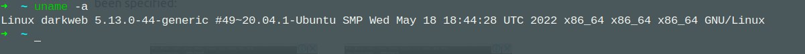

# **Linux Homework 1**

### Task 1.3

- **ping**  *buyrug'ini ishlatilishi :)*
  

### Task 1.4

- **Shell** - bu biz buyruqlar, dasturlar va qobiq skriptlarini ishga tushirishimiz mumkin bo'lgan muhit.

### Task 1.5

- **$** and **#** *belgilari :)*
  
  - **$** - bu belgi siz oddiy foydalanuvchi ekanligingizni bildiradi
  - **#** - bu belgi siz adminstrator ekanligingizni bildiradi ya'ni hamma joyni boshqarish huquqi sizda bo'ladi

### Task 1.6

- **whoami** and **grep ${USER} /etc/passwd**  *buyruqlarini ishlatib tekshiramiz :)*
  

### Task 1.7

- **man** - buyrug'i bizga linux commandalarini o'rganishda keng qulayliklarni yaratadi ya'ni bu buyruq orqali bizga kerakli terminal buyrug'ini qanday ishlashi bo'yicha qo'llanmaga ega bo'lamiz. *Masalan: **man grep** ko'rinishida yozsak quyidagicha ma'lumotlar keltirib chiqaradi bizga* 
   

### Task 1.8

- **date, pwd, ls, uname, id, who** - *buyruqlarini haqida va bajarib ko'ramiz :)*

  - **date** - buyrug'i terminalimizda bugungi sanani ko'rsatadi.

  - **pwd** - buyrug'i bizga ayni turgan joyimizgacha bo'lgan yo'lni ko'rsatadi

  - **ls** - buyrug'i bizga hozi turgan papkamizni ichida nimalar borligini ko'rsatadi

  - **uname** - buyrug'i bizga qanaqa tizimda ishlayotganimizni aniqlash uchun kerak ya'ni qanaqa tizim ekanligini ko'rsatadi.

  - **id** - buyrug'i bizga hozirgi yoki tizimdagi foydalanivchilarni id, uid, gruop id larini chiqarib beradi.

  - **who** - buyrug'i bizga tizimda hozir ishlayotgan foydalanuvchi va uni qachon kirganligi haqida ma'lumot beradi.

- **date** practikasi :)
  

- **uname -a** practikasi :)
  

- **w** practikasi :)
  

### Task 1.9

- **alias** - bu buyruqni ishlatishni o'rganishdan oldin qisqacha ta'rif: alias bizga commandalarni qisqaroq yozish va tezroq ishni bitirishimiz uchun anchayin qo'l keladi ya'ni uzundan uzun kodlarni biz o'zimizga qulay qilib olib ooshqa o'zgaruvchiga tenglab olib osha uzun kodlar ishlatiladigan joylarda o'zimiz tenglab olgan qisqagina o'zgaruvchini ishlatsak bo'ladi. Masalan quyidagicha
  

- **Variable** - bu ****************
- **Username** - bu foydalanayotgan serverimizni ichidagi foydalanuvchi nomilari hisoblanadi.
- **Hostname** - bu foydalanayotgan serverimizni globalniy ya'ni butun jahon taniydigan nomi hisoblanadi.
  
### Task 1.10

**Command-line recall**
- **history** - bu buyruq tizimda ishlatilgan barcha commandalarni  tartib bilan chiqarib beradi.
- **!n** - bu buyruq terminalda oxirgi n bilan boshlangan buyruqni ishlatmasdan terminalga yozib beradi. *Masalan: **!g** bo'lsa g bilan boshlangan oxirgisini chiqaradi*
  
- **!!** - bu buyruq oxirgi buyruqni qaytaradi uni ishga tushurmasdan yozib beradi.
- **!?string?** - bu buyruuq **!n** bilan bir xil.
  
### Task 1.11

- **|** - bu buyruq bizda pipe deyiladi, buni ishimizni anvchayendillashtirish uchun ya'ni takrorlanishni oldini olish uchun ishlatamiz. Masalan: bitta fayl ustida ikkita amal bajarishimiz kerak bo'lsa bu buyruqni ishlatamiz.
  
quyidagicha yozib ko'piroq bilib olsak bo'ladi :)

- **&** - bu buyruq terminalimizda buyruqlar ketma-ketligini bitta qatorga uzun qilib yozmaslik uchun ishlatamiz ya'ni chiroyliroq ishlash taktikasi va ishlatayotgan buyruqlarni anchayin qulay ko'ring uchun kerak va asosiy qiladigan ishi birinchi bergan buyruqni amalga oshiradi va uni tugashini kutmasdan backgraunga o'tkazib ikkinchi buyruqni ham ishga tushuraveradi.

- **<** - bu buyruq biron bir fayldagi malumotlarni tizim fayllar ichiga joylashtirish uchun kerak.
- **>** - bu buyruq tizim ichidagi fayllarni ichidagi ma'lumotlarni boshqa bir alohida fayl ga olishimiz uchun kerak.
- **;** - bu buyruq commanda tugaganligini bildiradi.
  
### Task 1.12

## **HOMEWORK - 1**
- ## **h-1**

- ## **h-2**
  Bu vazifani qilish uchun men ozgina script yozdim va natija oldim
  - 
  - 

- ## **h-3**

- *hostname*
  - 

- *username*
  - 

- *home directory*
  - 

- ## **h-4**

  - 
  - 

